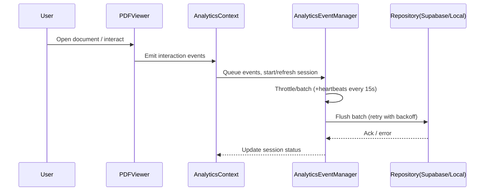
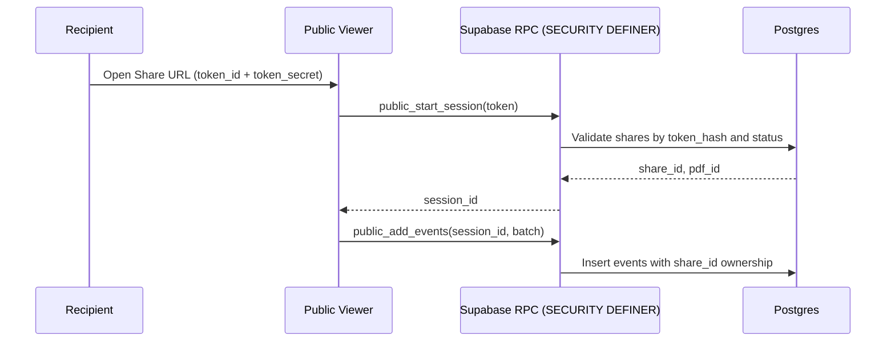

# Spectra AI — Software Design Document (SDD)

Version: 1.0  
Status: Draft  
Last Updated: 2025-08-11  
Owners: Engineering Team  
References: `docs/PRD.md`, `docs/SESSION_SECURITY.md`, `GLASSVIEW_INTEGRATION.md`, `PERFORMANCE.md`, `README.md`

## Table of Contents
1. Overview and Scope
2. Architecture Summary
3. Frontend Design
4. Backend and Data Design (Supabase)
5. Analytics Subsystem
6. Sharing Subsystem (Public Viewer)
7. Library and Storage
8. Security, Privacy, and Compliance
9. Performance, Reliability, and Scalability
10. Error Handling, Observability, and Logging
11. API and Integration Design
12. Testing Strategy and Quality Gates
13. Deployment, Configuration, and Environments
14. Backup, Migration, and Recovery
15. Accessibility, i18n, and UX
16. Risks, Assumptions, and Decisions
17. Traceability to PRD

---

## 1. Overview and Scope

Spectra AI is an intelligent PDF viewing platform with analytics, secure sharing, and administrative tooling. This document specifies the design to implement the PRD requirements with a focus on:
- Core PDF viewing and interaction
- Session and interaction analytics (private and public viewers)
- Secure sharing flows
- Library management (local and cloud) and storage
- Admin features and system health

Non-goals (current phase): native mobile apps, SSO/SAML, heavy server-side rendering.

---

## 2. Architecture Summary

### 2.1 System Context

```mermaid
graph TD
  User[End User / Analyst / Admin] -->|HTTPS| WebApp[React + TS (Vite)]
  PublicUser[Public Viewer Recipient] -->|Share URL| WebApp
  WebApp -->|Anon Key| Supabase[Supabase (Postgres + Auth + Storage + RPC)]
  WebApp -->|IndexedDB| LocalStore[Browser IndexedDB]
  WebApp -->|CDN| Assets[Static Assets (Vercel/Netlify/CDN)]
  Supabase -->|Auth| OAuth[Google / Apple]
  Supabase --> Storage[Supabase Storage: PDFs/Thumbnails]
  WebApp -.->|Edge RPC (optional)| EdgeFns[Supabase Edge Functions]
```

Key principles:
- Client-first with offline capabilities via IndexedDB.
- Repository abstraction to support local, cloud, and hybrid modes.
- Strict RBAC and RLS policies for multi-tenant isolation.
- Analytics designed for high-frequency, low-latency ingestion with batching.

### 2.2 High-Level Component View

```mermaid
graph LR
  UI[UI Pages & Components]
  PDF[PDF Engine & Viewer]
  PLUG[Feature/Plugin Framework]
  CTX[Contexts (Analytics, PDF, Theme)]
  REPO[Repositories (Local / Supabase / Hybrid)]
  ANALYTICS[Analytics Event Manager]
  SHARE[Sharing Service]
  LIB[Library Service]
  ADMIN[Admin & Setup]

  UI --> PDF
  UI --> PLUG
  UI --> CTX
  UI --> LIB
  CTX --> ANALYTICS
  LIB --> REPO
  SHARE --> REPO
  ANALYTICS --> REPO
  ADMIN --> REPO
```

Codebase anchors:
- Pages and layout: `src/pages/*`, `src/layout/AppShell.tsx`
- Viewer: `src/pdf/PdfEngine.tsx`, `src/components/pdf/PDFViewer.tsx`, `src/pdf/PdfContext.tsx`
- Analytics: `src/contexts/EnhancedAnalyticsContext.tsx`, `src/lib/analytics/AnalyticsEventManager.ts`, `src/features/analytics/*`
- Sharing: `src/features/share/*`, `src/features/publicViewer/*`
- Library: `src/features/library/*`, `src/lib/storage/PDFStorageManager.ts`, `src/lib/repositories/*`
- Admin: `src/components/admin/*`, `src/lib/admin/*`

---

## 3. Frontend Design

### 3.1 Technology Stack
- React 18 + TypeScript
- Vite build tooling
- Tailwind CSS and Emotion for styling
- React Router for navigation
- PDF.js for rendering
- D3/Canvas for heatmaps and charts
- Framer Motion for animations and transitions
- Lucide React for icons

### 3.2 Application Structure
- Layout Shell: `src/layout/AppShell.tsx`
- Routes/Pages: `src/pages/{Dashboard,Library,Reports,Admin,User}.tsx`
- Feature Modules: `src/features/*` (analytics, library, publicViewer, share, export, user, snipping)
- UI Components: `src/components/*` (pdf, dashboard, admin, auth, ui, nav)
- Contexts: `src/contexts/*` (analytics contexts, etc.)
- Libraries/Domain: `src/lib/*` (repositories, analytics, supabase client, storage)

### 3.3 PDF Viewer and Engine
- Entry components: `src/components/pdf/PDFViewer.tsx`, `src/pdf/PdfEngine.tsx`
- Responsibilities:
  - Render PDF pages with virtualization and lazy loading
  - Provide zoom, rotate, thumbnails, page navigation
  - Publish structured interaction events (scroll, zoom, page change, click, selection)
  - Cooperate with analytics context for session lifecycle

### 3.4 Feature/Plugin Framework
- Base abstractions: `src/features/base/*` (FeatureOverlay, FeatureRegistry, types)
- Plugins:
  - Analytics overlays: heatmap, interaction visualizers (`src/features/analytics/*`)
  - Tools: snipping, export (`src/features/snipping/*`, `src/features/export/*`)
- Features register with a central registry and subscribe to context events.

### 3.5 State and Contexts
- `EnhancedAnalyticsContext`: maintains session state, throttles/queues events, flushes heartbeats.
- `PdfContext`: exposes current document, page index, viewport, and engine controls.
- Theme/Settings: user preferences in local storage; profile-backed when authenticated.

### 3.6 Navigation and Access Control
- Private routes gated by `AuthGuard` (see `src/components/auth/AuthGuard.tsx`).
- Public viewer routes access limited to share-token contexts.
- Admin-only routes guarded by role checks (profile roles and/or claims).

### 3.7 Error Boundaries
- Route-level error boundaries for viewer and analytics widgets.
- UI fallbacks with actionable retry/log-out for auth errors.

---

## 4. Backend and Data Design (Supabase)

### 4.1 Storage and Persistence
- Primary DB: Postgres (Supabase)
- Object Storage: Supabase Storage buckets: `pdfs/` and `thumbnails/`
- Client-side: IndexedDB used for offline PDFs, thumbnails, and queued analytics

### 4.2 Core Entities (DB)

Proposed schemas (snake_case), simplified to core fields:

- profiles
  - id uuid PK (matches `auth.users.id`)
  - email text, display_name text
  - created_at timestamptz default now()

- library_pdfs
  - id uuid PK
  - owner_id uuid REFERENCES profiles(id)
  - filename text, size_bytes bigint, page_count int, metadata jsonb
  - storage_path text, thumbnail_path text
  - created_at, updated_at timestamptz

- shares
  - id uuid PK
  - owner_id uuid REFERENCES profiles(id)
  - pdf_id uuid REFERENCES library_pdfs(id)
  - token_id uuid -- public identifier
  - token_hash text -- SHA-256 of secret token (not reversible)
  - status text CHECK IN ('active','revoked','expired')
  - expires_at timestamptz NULL
  - created_at timestamptz default now()

- analytics_sessions
  - id uuid PK
  - pdf_id uuid REFERENCES library_pdfs(id)
  - user_id uuid NULL REFERENCES profiles(id) -- null for public
  - share_id uuid NULL REFERENCES shares(id)
  - viewer_type text CHECK IN ('private','public')
  - started_at timestamptz default now()
  - ended_at timestamptz NULL
  - duration_ms bigint NULL
  - user_agent text, device jsonb, locale text

- analytics_events
  - id bigserial PK
  - session_id uuid REFERENCES analytics_sessions(id)
  - ts timestamptz default now()
  - type text -- 'page_view','click','scroll','zoom','rotate','heartbeat','select'
  - page int NULL, x float NULL, y float NULL, zoom float NULL
  - details jsonb

- report_jobs (optional future)
  - id uuid PK, owner_id, params jsonb, status, created_at, completed_at

Note: Keep PII minimal (avoid IP; hash or drop if not needed). Store only user_agent and general device context.

### 4.3 Repository Pattern
- Interfaces: `src/lib/repositories/interfaces.ts`
- Implementations:
  - Local: `src/lib/repositories/local/*` (IndexedDB)
  - Supabase: `src/lib/repositories/supabase/*`
  - Hybrid manager: `src/lib/repositories/HybridRepositoryManager.ts` orchestrates reads/writes and sync

### 4.4 RLS and Access Control
- `profiles`: user can select/update self; admins can select all
- `library_pdfs`: owner-only R/W; admins read; public none
- `shares`: owner-only R/W; admins read; public none
- `analytics_sessions` and `analytics_events`:
  - Private sessions: owner of `library_pdfs` can select; inserts require authenticated user or trusted RPC
  - Public sessions: inserts allowed only through SECURE RPC with share token validation (or Edge Function)

Recommended secure path for public ingestion:
1) `rpc.public_start_session(token text, client_info jsonb) RETURNS uuid` (SECURITY DEFINER) validates `shares.token_hash` and returns new `analytics_sessions.id` tied to `share_id` and `pdf_id`.
2) `rpc.public_add_events(session_id uuid, events jsonb)` appends batched events where session belongs to an active share.

This prevents broad anonymous table inserts while keeping RLS strict.

### 4.5 Storage Conventions
- PDFs: `pdfs/${owner_id}/${pdf_id}.pdf`
- Thumbnails: `thumbnails/${owner_id}/${pdf_id}.jpg`
- Public URLs not exposed directly; signed URLs or proxy if needed. Private by default.

---

## 5. Analytics Subsystem

### 5.1 Event Lifecycle



### 5.2 Session Management
- Session begins when a document is opened or viewer gains focus.
- Heartbeat every 15s; idle timeout configurable (e.g., 60–120s).
- Session ends on close, navigation away, or idle threshold.

### 5.3 Client Controls
- Event coalescing and sampling for high-frequency interactions (scroll/mousemove).
- Backpressure-aware batching with size/time thresholds (e.g., 50 events or 2 seconds).
- Offline queueing to IndexedDB; background flush when reconnected.

### 5.4 Data Contract (Event)
```json
{
  "type": "page_view|click|scroll|zoom|rotate|heartbeat|select",
  "page": 12,
  "x": 512.4,
  "y": 320.1,
  "zoom": 1.5,
  "details": {"deltaY": 120, "selection": "..."},
  "ts": "ISO-8601"
}
```

---

## 6. Sharing Subsystem (Public Viewer)

### 6.1 Share Token Model
- A share consists of a public `token_id` and a secret `token_secret` sent only in URLs.
- Only a `token_hash = sha256(token_secret)` is stored server-side.
- Share URL structure: `/s/{token_id}/{token_secret}` (secret can be query param if needed). The app must never persist the plaintext token beyond session start to reduce exposure.

### 6.2 Public Session Flow



### 6.3 Public Viewer Constraints
- Minimal UI; no authenticated features exposed.
- Strict CSP to reduce exfiltration risk.
- No PII captured; device/user_agent only.

---

## 7. Library and Storage

### 7.1 Local vs Cloud
- Local: IndexedDB for offline-first, quick preview; ideal for personal libraries.
- Cloud: Supabase for team/enterprise, multi-device access, analytics aggregation.
- Hybrid: `HybridRepositoryManager` chooses optimal source and syncs on background.

### 7.2 Upload Pipeline
1) Drag & drop in `src/features/library/components/DropZone.tsx`
2) Validate MIME and size; extract basic metadata
3) Generate thumbnail via PDF.js off-screen render
4) Persist to IndexedDB; enqueue cloud upload if connected and authenticated
5) On cloud upload success, store storage paths in DB

### 7.3 Deletion and Retention
- Soft-delete flag (optional future) vs hard delete.
- Owner-only delete operations; cascading delete of thumbnails and analytics (policy-based).

---

## 8. Security, Privacy, and Compliance

### 8.1 Authentication and Authorization
- Supabase Auth (email/password, Google, Apple).
- Role model: `user` and `admin` via profile roles; admin tools limited to org owners or flagged users.

### 8.2 RLS Policies
- Enforce on all tables with least-privilege defaults `USING` and `WITH CHECK` clauses.
- Public ingestion only via SECURITY DEFINER RPC or Edge Functions.

### 8.3 Data Protection
- HTTPS everywhere; HSTS and security headers.
- Encryption in transit; storage-level encryption at rest.
- Token hashing for share secrets; short-lived signed URLs if direct storage access is needed.

### 8.4 Privacy
- GDPR-aligned: no IP storage; allow analytics opt-out; data export/delete upon request.
- Cookie-less by default; rely on auth session and local storage.

### 8.5 Session Security
- See `docs/SESSION_SECURITY.md` for session timeouts, refresh, and storage.

---

## 9. Performance, Reliability, and Scalability

### 9.1 Frontend
- Page virtualization and lazy rendering; memoized canvases for viewed pages.
- Debounced/incremental re-render on zoom and resize.
- Event batching and compression for analytics.

### 9.2 Backend
- Partitioning strategy (future): time-based partitions for `analytics_events`.
- Indexes: `(session_id, ts)`, `(pdf_id)`, `(owner_id)`; JSONB GIN on `details` if queried.
- Background jobs (future): materialized views for aggregates.

### 9.3 SLOs (from PRD NFRs)
- Initial page load < 3s; large PDF render ready < 5s.
- Analytics ingestion p50 < 100ms.
- 99.9% availability for viewing.

### 9.4 Caching
- HTTP cache for static assets via CDN.
- Client-side caching of thumbnails and metadata.

---

## 10. Error Handling, Observability, and Logging

### 10.1 Client
- Centralized error boundary per route; toast notifications for recoverable errors.
- Structured logs to console (dev) and remote sink (prod) via pluggable adapter.

### 10.2 Server/DB
- RPC error codes normalized; do not leak secrets in messages.
- APM/monitoring recommended (Sentry, Logflare) for Edge Functions and RPC.

### 10.3 Analytics Delivery Guarantees
- At-least-once delivery with idempotent inserts by `(session_id, ts, seq)` if required.
- Retries with exponential backoff; dead-letter queue in IndexedDB for unrecoverable.

---

## 11. API and Integration Design

### 11.1 Client-side Repository Interfaces
- LibraryRepository: CRUD PDFs, search, thumbnails, upload/download
- AnalyticsRepository: start/end session, batch insert events, fetch dashboards
- ShareRepository: create/revoke share links, fetch share metadata

### 11.2 RPC Endpoints (Supabase)
- `public_start_session(token text, client_info jsonb) returns uuid`
- `public_add_events(session_id uuid, events jsonb)`
- `private_end_session(session_id uuid, duration_ms bigint)`

All functions are schema-qualified and SECURITY DEFINER with input validation.

### 11.3 External Integrations
- OAuth (Google/Apple) via Supabase.
- Optional: webhook for report completion (future).

---

## 12. Testing Strategy and Quality Gates

### 12.1 Unit Tests
- Repositories: mock Supabase client; verify RLS-sensitive paths.
- Analytics event manager: batching, throttling, retry behavior.
- PDF engine utilities: page calculations, viewport math.

### 12.2 Integration Tests
- Public session start via RPC; insert events; verify row visibility constraints.
- Library upload -> thumbnail generation -> DB persistence.

### 12.3 E2E Tests
- Core viewer flows; share links open; analytics captured; admin dashboard visibility.

### 12.4 Performance Tests
- Synthetic large-PDF load; event storms; long sessions.

### 12.5 Quality Gates
- TypeScript strict; ESLint; Prettier.
- CI: build + unit + integration + selected E2E.

---

## 13. Deployment, Configuration, and Environments

### 13.1 Environments
- Local dev: `.env.local` with Supabase project refs.
- Staging and Production Supabase projects; separate Storage buckets.

### 13.2 Configuration
- `VITE_SUPABASE_URL`, `VITE_SUPABASE_ANON_KEY` (client)
- Service role key kept server-side only (for admin scripts/Edge Functions).

### 13.3 Build and Delivery
- Vite build, deployed to Vercel/Netlify or similar; CDN cache headers.
- Supabase migrations tracked and versioned.

---

## 14. Backup, Migration, and Recovery

### 14.1 Backup Strategy
- Daily automated DB backups with PITR.
- Storage lifecycle rules for thumbnails; PDFs retained until hard-delete.

### 14.2 Migration
- Use `src/lib/migration/MigrationEngine.ts` for client data moves.
- DB migrations accompanied by data validations; rollback plans with safety backups.

### 14.3 Recovery
- Restore from backups; rehydrate caches and thumbnails as needed.

---

## 15. Accessibility, i18n, and UX

### 15.1 Accessibility
- WCAG 2.1 AA targets; keyboard navigation for viewer and controls.
- Color contrast and focus indicators; ARIA for custom widgets.

### 15.2 i18n
- Translation-ready UI; locale stored in profile and local storage.

### 15.3 UX Guidelines
- Minimal public viewer; advanced tools behind authenticated UI.
- Clear loading/progress states during PDF render and uploads.

---

## 16. Risks, Assumptions, and Decisions

### 16.1 Key Decisions
- Client-first architecture with repository abstraction.
- Public analytics ingestion via secure RPC rather than direct table inserts.
- Token hashing for share secrets.

### 16.2 Risks & Mitigations
- Large event volume: batching + partitioning + aggregates.
- PDF rendering performance: virtualization + memoized canvases.
- Public link abuse: rate limiting RPC + CAPTCHA (if abused) + token revocation.

### 16.3 Assumptions
- Supabase limits within project quotas; CDN available.
- Users accept analytics collection or can opt out per settings.

---

## 17. Traceability to PRD

| PRD Capability | Design Elements |
| --- | --- |
| Advanced PDF Viewing | `PDFViewer.tsx`, `PdfEngine.tsx`, virtualization, zoom/rotate |
| Analytics & Heatmaps | `EnhancedAnalyticsContext`, `AnalyticsEventManager`, D3 overlays |
| Secure Sharing | `shares` schema, token hashing, public RPCs, public viewer |
| Library Management | `LibraryRepository`, `PDFStorageManager`, IndexedDB + Supabase |
| User Auth & Profiles | Supabase Auth, `profiles` table, `AuthGuard` |
| Admin & Monitoring | Admin pages, role checks, activity dashboards |
| Backup & Migration | `MigrationEngine.ts`, backup strategy, safety backups |
| Plugin Architecture | `FeatureRegistry`, analytics/tool overlays |

---

Appendix A: Notable Code Anchors
- `src/pdf/PdfEngine.tsx` — PDF rendering lifecycle and viewport handling
- `src/components/pdf/PDFViewer.tsx` — UI controls and integration with contexts
- `src/contexts/EnhancedAnalyticsContext.tsx` — analytics session/state
- `src/lib/analytics/AnalyticsEventManager.ts` — batching, throttling, flush
- `src/lib/repositories/*` — repository interfaces and implementations
- `src/lib/storage/PDFStorageManager.ts` — storage orchestration and thumbnails
- `src/features/publicViewer/*` — public viewer flow and UI
- `src/features/share/*` — share creation and management


