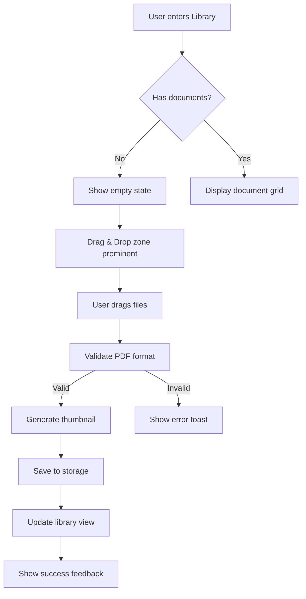
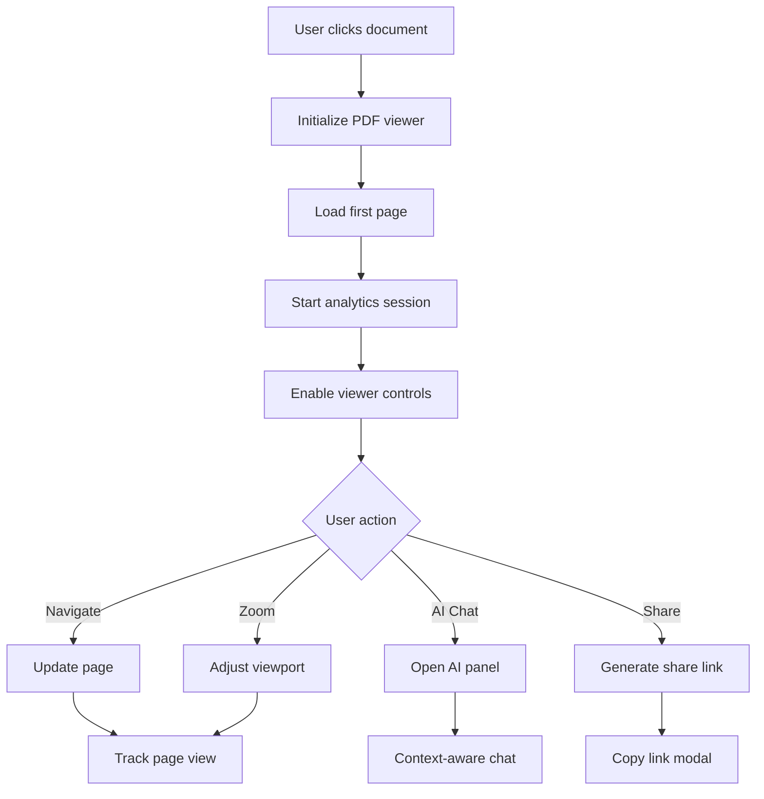
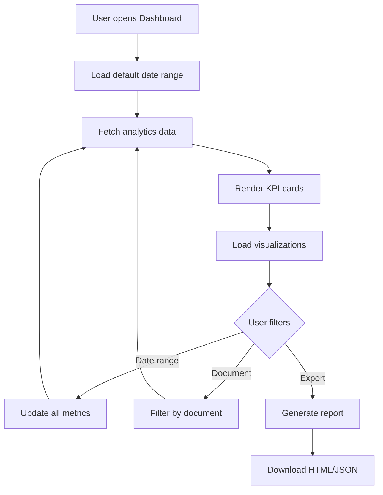
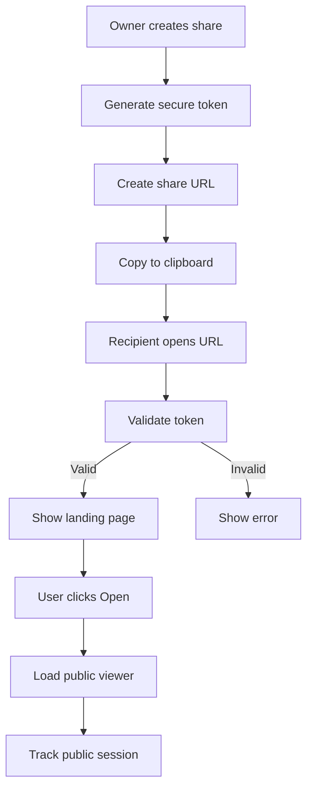
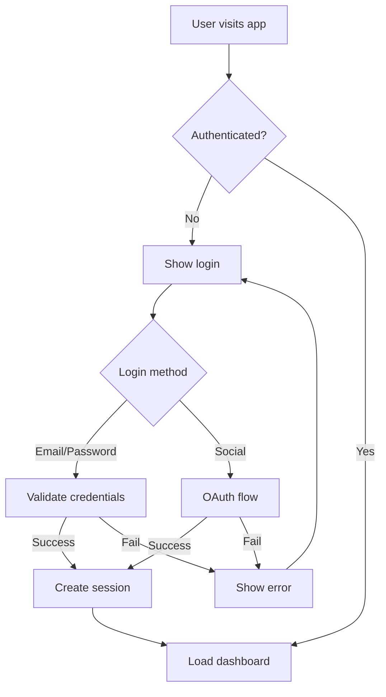

# Patterns and Flows - Spectra AI

This document outlines the common UI patterns, user flows, and interaction paradigms used throughout the Spectra AI application.

## Table of Contents

1. [Core User Flows](#core-user-flows)
2. [Navigation Patterns](#navigation-patterns)
3. [Interaction Patterns](#interaction-patterns)
4. [Data Display Patterns](#data-display-patterns)
5. [Form Patterns](#form-patterns)
6. [Feedback Patterns](#feedback-patterns)
7. [Loading & Error States](#loading--error-states)
8. [Responsive Patterns](#responsive-patterns)

## Core User Flows

### 1. Document Upload and Management Flow



### 2. Document Viewing Flow



### 3. Analytics Review Flow



### 4. Public Share Flow



### 5. Authentication Flow



## Navigation Patterns

### Primary Navigation Pattern
- **Fixed sidebar**: Always visible on desktop (280px expanded, 72px collapsed)
- **Mobile drawer**: Slide-out navigation on mobile devices
- **Breadcrumbs**: Secondary navigation for deep hierarchies
- **Tab navigation**: For related content sections

### Navigation States
1. **Default**: Normal appearance
2. **Hover**: Subtle background change
3. **Active**: Highlighted with accent color
4. **Disabled**: Reduced opacity, no interaction

### Navigation Hierarchy
```
Primary (Sidebar)
├── Dashboard
├── Library
├── Reports
├── Admin (role-based)
└── User Menu
    ├── Settings
    ├── Help
    └── Sign Out

Secondary (In-page)
├── Tabs
├── Breadcrumbs
└── Pagination
```

## Interaction Patterns

### 1. Glassmorphic UI Pattern
- **Background**: Semi-transparent with backdrop blur
- **Border**: Subtle white/translucent border
- **Shadow**: Soft shadow for depth
- **Hover**: Slight opacity increase

```css
/* Glass panel pattern */
.glass-panel {
  backdrop-filter: blur(12px);
  background: rgba(255, 255, 255, 0.1);
  border: 1px solid rgba(255, 255, 255, 0.2);
  box-shadow: 0 8px 32px rgba(0, 0, 0, 0.1);
}
```

### 2. Card Interaction Pattern
- **Default**: Static with subtle shadow
- **Hover**: Scale up slightly (1.02), increase shadow
- **Click**: Scale down briefly (0.98)
- **Selected**: Border highlight with accent color

### 3. Button Patterns

#### Primary Actions
- **Purpose**: Main CTAs (Save, Upload, Generate)
- **Style**: Solid background with accent color
- **Interaction**: Darken on hover, translate down on click

#### Secondary Actions
- **Purpose**: Alternative actions
- **Style**: Glass background with border
- **Interaction**: Increase opacity on hover

#### Tertiary Actions
- **Purpose**: Less important actions
- **Style**: Text only, no background
- **Interaction**: Subtle background on hover

### 4. Modal Pattern
- **Backdrop**: Dark overlay with blur
- **Animation**: Fade in backdrop, slide up content
- **Dismissal**: Click outside, ESC key, or close button
- **Stacking**: Proper z-index management for multiple modals

### 5. Drag and Drop Pattern
- **Idle**: Dashed border, muted appearance
- **Hover**: Solid border, highlight background
- **Dragging**: Show drop zone, animate border
- **Processing**: Progress indicator, disable interaction

## Data Display Patterns

### 1. Table Pattern
- **Header**: Sticky, sortable columns
- **Rows**: Alternating backgrounds on hover
- **Actions**: Contextual menu on row hover/click
- **Pagination**: Bottom-aligned controls
- **Empty state**: Centered message with action

### 2. Grid Pattern
- **Layout**: Responsive auto-fit grid
- **Cards**: Consistent height within rows
- **Spacing**: 24px gap between items
- **Loading**: Skeleton cards during fetch
- **Empty**: Prominent CTA to add content

### 3. Chart Pattern
- **Container**: Glass panel with padding
- **Title**: Top-left with optional subtitle
- **Legend**: Bottom or right placement
- **Tooltip**: On hover with detailed info
- **Export**: Top-right action button

### 4. KPI Card Pattern
- **Layout**: Icon, title, value, trend
- **Animation**: Number count-up on load
- **Sparkline**: Mini chart showing trend
- **Comparison**: Delta with previous period

## Form Patterns

### 1. Input Field Pattern
```
Label
┌─────────────────────────┐
│ Placeholder text        │
└─────────────────────────┘
Helper text or error message
```

States:
- **Default**: Subtle border
- **Focus**: Highlighted border, slight glow
- **Error**: Red border, error message below
- **Disabled**: Reduced opacity, no interaction

### 2. Form Layout Pattern
- **Single column**: For simple forms
- **Two column**: For complex forms on desktop
- **Sections**: Group related fields
- **Actions**: Sticky footer with primary/secondary buttons

### 3. Validation Pattern
- **Inline**: Real-time validation on blur
- **Submit**: Validate all fields on submit
- **Errors**: Show below fields with red text
- **Success**: Green checkmark for valid fields

## Feedback Patterns

### 1. Toast Notifications
- **Position**: Bottom-right corner
- **Animation**: Slide up and fade in
- **Duration**: 4s for info, 6s for errors
- **Actions**: Optional action button
- **Stack**: Maximum 3 visible at once

Types:
- **Success**: Green with checkmark
- **Error**: Red with X icon
- **Warning**: Yellow with alert icon
- **Info**: Blue with info icon

### 2. Loading States
- **Inline**: Replace content with spinner
- **Overlay**: Semi-transparent overlay with spinner
- **Skeleton**: Show content structure while loading
- **Progress**: Bar or percentage for long operations

### 3. Empty States
- **Icon**: Relevant illustration
- **Title**: Clear, descriptive heading
- **Description**: Helpful explanation
- **Action**: Primary CTA to resolve

### 4. Error States
- **404**: Full page with navigation options
- **Failed load**: Inline error with retry
- **Permission**: Explanation with contact admin
- **Network**: Offline indicator with retry

## Loading & Error States

### Loading Patterns

#### Skeleton Loading
```
┌─────────────────────────┐
│ ████████████████        │  <- Animated shimmer
│ ████████████            │
│ ██████████████████      │
└─────────────────────────┘
```

#### Progress Indicators
1. **Determinate**: Show exact progress (uploads)
2. **Indeterminate**: Spinner for unknown duration
3. **Stepped**: Multi-step process indicator

### Error Handling Patterns

#### Error Display Hierarchy
1. **Field-level**: Inline below input
2. **Section-level**: Alert box in section
3. **Page-level**: Banner at top
4. **App-level**: Modal or full page

#### Error Recovery
- **Retry**: Automatic with backoff
- **Manual retry**: User-initiated
- **Fallback**: Degraded functionality
- **Support**: Contact information

## Responsive Patterns

### 1. Breakpoint Behavior
```
Desktop (>1024px)
├── Full sidebar
├── Multi-column layouts
├── Hover interactions
└── Advanced features visible

Tablet (768-1024px)
├── Collapsible sidebar
├── 2-column max layouts
├── Touch-optimized
└── Simplified navigation

Mobile (<768px)
├── Drawer navigation
├── Single column
├── Bottom sheets
└── Thumb-friendly zones
```

### 2. Component Adaptation

#### Navigation
- **Desktop**: Fixed sidebar
- **Tablet**: Collapsible sidebar
- **Mobile**: Bottom drawer

#### Tables
- **Desktop**: Full table with all columns
- **Tablet**: Hide secondary columns
- **Mobile**: Card-based layout

#### Modals
- **Desktop**: Centered modal
- **Tablet**: Larger modal
- **Mobile**: Full-screen sheets

### 3. Touch Optimization
- **Targets**: Minimum 44x44px
- **Spacing**: Increased padding on mobile
- **Gestures**: Swipe for navigation
- **Feedback**: Touch ripple effects

### 4. Content Prioritization
1. **Progressive disclosure**: Show core content first
2. **Accordion**: Collapse secondary sections
3. **Tabs**: Organize related content
4. **Load more**: Pagination for long lists

## Best Practices

### Consistency
- Use established patterns throughout
- Maintain visual hierarchy
- Keep interactions predictable
- Follow platform conventions

### Performance
- Lazy load heavy components
- Virtualize long lists
- Optimize animations
- Cache repeated data

### Accessibility
- Keyboard navigation support
- Screen reader compatibility
- Color contrast compliance
- Focus indicators

### User Feedback
- Acknowledge every action
- Show progress for long operations
- Provide clear error messages
- Enable easy recovery

---

**Note**: These patterns should be implemented consistently across the application to provide a cohesive user experience. Always consider the context and user needs when applying these patterns.
